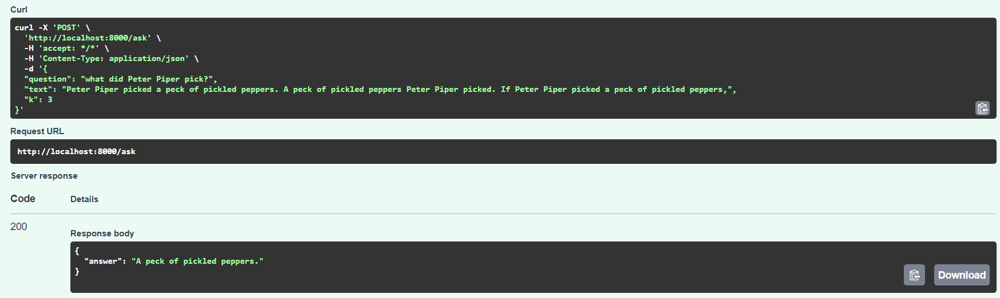

# DocQA


A small FastAPI service that answers questions about a text using a **local LLM** (Ollama: free, no API key, nothing leaves my personal machine). It first retrieves the relevant passages with TF-IDF, then lets the model answer **only from those passages**. Includes tests, Docker, CI and an evaluation script that measures answer quality against a retrieval-only baseline.



## How it works

```
POST /ask {question, text, k}
   -> main.py       validates the input (empty fields -> HTTP 422)
   -> pipeline.py   retrieve -> build prompt -> call the model
   -> rag.py        split the text into overlapping chunks, rank them against the
                    question (TF-IDF + cosine similarity), keep the top k
   -> llm.py        send the prompt to Ollama's HTTP API
   <- {"answer": "..."}
```

The prompt tells the model to answer only from the given context and to reply `Not in the document.` otherwise. The same `pipeline.answer` function serves the API and the evaluation, so what is measured is exactly what is deployed.

## Quick start

Prerequisite: [Ollama](https://ollama.com) installed and running, and the model downloaded once:

```bash
ollama pull llama3.2
```

**Locally**

```bash
cd DocQA
python -m venv .venv
source .venv/bin/activate        # Windows: .venv\Scripts\activate
pip install -r requirements.txt
uvicorn app.main:app --reload
```

Interactive API docs: http://localhost:8000/docs

**With Docker** (the container reaches Ollama on the host via `host.docker.internal`)

```bash
docker build -t docqa .
docker run -p 8000:8000 -e OLLAMA_URL=http://host.docker.internal:11434 docqa
```

**Settings** (environment variables, both optional): `OLLAMA_URL` (default `http://localhost:11434`) and `LLM_MODEL` (default `llama3.2`).

**Example request**

```bash
curl -X POST localhost:8000/ask -H "Content-Type: application/json" \
  -d '{"question": "Where was the Atlas rover built?", "text": "The Atlas rover was built in Bremen."}'
# {"answer": "..."}   <- wording depends on the model
```

## Tests

```bash
pytest
```

14 tests; the LLM is replaced by a fake, so they need neither Ollama nor network access. They cover chunking and retrieval, the API (validation, error handling, that retrieved context reaches the prompt) and the Ollama wrapper. GitHub Actions runs them on every push (`.github/workflows/ci.yml` at the repository root).

## Evaluation

`eval/` contains a fictional document and 16 questions with one expected keyword each; the last question asks something the document does not contain, so the correct behaviour is to say so. A case counts as correct if the keyword appears in the answer.

```bash
python -m eval.run_eval --offline --k 1 2 3 5   # retrieval-only baseline, no model needed
python -m eval.run_eval --k 1 2 3 5             # with the local LLM (Ollama must be running)
```

Results (`llama3.2` via Ollama, temperature 0):

| Variant | k=1 | k=2 | k=3 | k=5 |
|---|---|---|---|---|
| Retrieval only (baseline) | 10/16 | 14/16 | 15/16 | 15/16 |
| LLM (llama3.2) | 11/16 | 15/16 | 16/16 | 16/16 |

What the numbers show:
- The LLM adds one correct answer at every k. At k=3 it fixes the unanswerable question by replying "Not in the document."
- **Retrieval is the bottleneck, not the model.** At k=1 the model mostly answers "Not in the document." when the retrieved chunk lacks the answer, which is the intended behaviour. One error (trip duration answered with the mission length) came from the wrong chunk being retrieved.
- k=3 is a sensible default; larger k adds nothing here.

## Limitations

- The test document is tiny (about 4 chunks), so at k=3 almost the whole document reaches the model. The k=1 and k=2 rows are the informative ones. 16 questions on one document is a small sample; one question of difference is noise.
- Keyword matching is crude: a correct answer phrased differently ("6" instead of "six") counts as a miss.
- TF-IDF matches words, not meaning, so paraphrased questions retrieve worse than with embeddings.

## Possible next steps

- Embedding-based retrieval, compared against TF-IDF in the same evaluation.
- A larger, multi-document test set with several accepted keywords per question.
- Conversation memory and source citations in the answer.

## Project structure

```
DocQA/
  app/
    main.py        FastAPI app: GET /health, POST /ask
    pipeline.py    retrieve -> prompt -> model
    rag.py         chunking and TF-IDF retrieval
    llm.py         Ollama client (the only file that talks to the model)
  tests/           pytest suite (LLM mocked)
  eval/            test document, questions, evaluation script
  Dockerfile, requirements.txt, pytest.ini, .env.example
```
